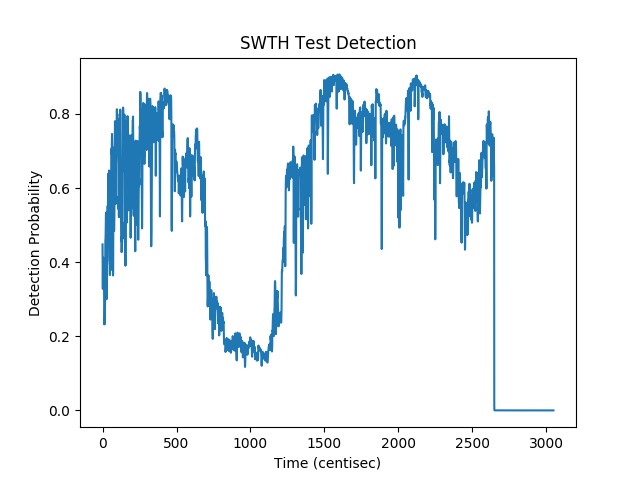
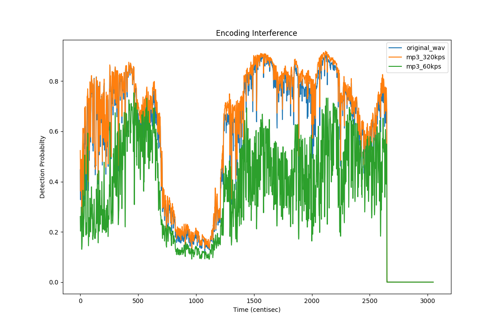

This library was commissioned by the National Park Service to assist with ornithological research in Alaska. <br>
It's purpose is to automatically detect the songs of [select avian species](#detection-thresholds) in recorded audio. 
<br>

## Table of Contents

* [Background](#background)
* [Author](#author)
* [Detection Library](#usage)
    * [How to Use](#usage)
        * [Command Line](#using-command-line)
        * [Code](#using-code)
    * [Installation](#installation)
* [Model Training](#model-training)
* [Testing](#smoke-tests)
* [Troubleshooting](#troubleshooting)
* [Dependencies](#dependencies)
* [Public Domain](#public-domain)


### Background

Since 2001 researchers at Denali National Park have collected extensive audio recordings throughout the park
in an initiative to protect and study the natural acoustic environment. Recordings often contain sounds which can used to better understand avian occupancy, abundance, phenological timing, or other quantities of interest to conservation efforts. The identification and annotation of avian species over thousands of hours of audio would require an enormous amount of time from skilled technical staff. Recent advances in artificial intelligence technology have drastically improved the ability of machines to perceive audio signals at human levels. This library uses machine listening models pre-trained on Denali audio to help automatically identify a variety of
avian species, speeding the analysis several fold.

---

### Author

This library and the associated listening models were created by [Cameron Summers](mailto:cameron@lightenai.com),
who is a researcher in machine learning and artificial intelligence located in the San Francisco Bay Area.

---

### Usage

At a high level, the library takes in (1) audio files, (2) species lists, and (3) detection thresholds for each species, and outputs a corresponding timeline of detection probabilities for each species. A probability of 0.0 means the model absolutely expects species **is not** vocalizing, while a probability of 1.0 means the model absolutely expects species **is** vocalizing. Users may also choose to output audio clips of each detection exceeding the threshold. These can be useful for rapid, visual proofing of automated analysis results.


The configuration for the models is carefully tuned for optimal detection performance. It is helpful to
understand some of these parameters to be able to interpret the outputs of the library:
 
* *window_size_sec* - Size of the detection window
* *hop_size* - Separation between consecutive overlapping detection windows

For the models in this library, the window size is 4.0 seconds and the hop size is 0.01 seconds. Thus for a 30 second long file, there should be 3000 detections. The first detection window goes from 0.0 seconds in the audio to 4.0 seconds, the second window from 0.01 seconds to 4.01 seconds, and so on.


##### Models

Each species has an already-trained model in a folder and they are stored in the `models` directory
of this project. The user provides a path to one of these to use
it for detections.


##### Detection Thresholds

When running a detector, you will likely use these recommended thresholds:
 
Species | Code | Recommended Threshold
--- | --- | ---
American Robin | AMRO | 0.6
Blackpoll Warbler | BLPW | 0.2
Fox Sparrow | FOSP | 0.7
White-crowned Sparrow | WCSP | 0.99
Common Raven | CORA | 0.1
Dark-eyed Junco | DEJU | 0.2
Greater Yellowlegs | GRYE | 0.3
Hermit Thrush | HETH | 0.1
Swainson’s Thrush | SWTH | 0.6
White-tailed Ptarmigan | WTPT | 0.9


Using your own thresholds:

Knowledge of [Binary Classification](https://en.wikipedia.org/wiki/Binary_classification) and associated evaluation
techniques is useful for setting thresholds. A user might vary the detection thresholds depending on the 
application. If to goal is to answer the question "Does my species exist anywhere in this file?", this might
call for a high threshold to limit [Type I Errors](https://en.wikipedia.org/wiki/Type_I_and_type_II_errors#Type_I_error).
However, if the goal is to answer the question of "Precisely how many calls occurred in the file?", then a lower
threshold may be appropriate to limit [Type II Errors](https://en.wikipedia.org/wiki/Type_I_and_type_II_errors#Type_II_error).


#### Using Command Line

For help:

`python -m nps_acoustic_discovery.discover -h`


```
usage: Audio event detection for the National Park Service [-h]
                                                           -m MODEL_DIR_PATH
                                                           -t THRESHOLD
                                                           [-o {probs,detections,audio}]
                                                           --ffmpeg FFMPEG
                                                           audio_path save_dir

positional arguments:
  audio_path            Path to audio file on which to run the classifier
  save_dir              Directory in which to save the output.

optional arguments:
-h, --help            show this help message and exit
-m MODEL_DIR_PATH, --model_dir_path MODEL_DIR_PATH
                    Path to model(s) directories for classification
-t THRESHOLD, --threshold THRESHOLD
                    The threshold for a positive detection
-o {probs,detections,audio}, --output {probs,detections,audio}

                        Type of output file:
                             probs: Raw probabilities over time
                             detections: Raven detections file
                             audio: Audio slices for each detection

--ffmpeg FFMPEG       Path to FFMPEG executable
--ffmpeg_quiet        Suppress ffmpeg output for detection processing
--chunk_size_minutes CHUNK_SIZE_MINUTES
                      Number of minutes of audio to process at a time in large files
```


##### Command Line Examples

Running one model to generate a Raven file:

`python -m nps_acoustic_discovery.discover <path_to_audio> <path_to_save_dir> -m <model_dir> -t <threshold> -o detections`

Running two species models with two different thresholds generates two
Raven files describing where the model detection probabilities
exceeded the thresholds:

`python -m nps_acoustic_discovery.discover <path_to_audio> <path_to_save_dir> -m <model_dir1> -m <model_dir2> -t <threshold1> -t <threshold2> -o detections`

Running one model to generate a file with raw probabilities while suppressing ffmpeg output:

`python -m nps_acoustic_discovery.discover <path_to_audio> <path_to_save_dir> -m <model_dir> -t <threshold> -o probs --ffmpeg_quiet`

Running one model to generate an audio file (possibly many) where the
model detection probabilities exceeded the threshold. Chunk size in minutes is set to 30 seconds
since there is a lot of RAM available.

`python -m nps_acoustic_discovery.discover <path_to_audio> <path_to_save_dir> -m <model_dir> -t <threshold> -o audio --chunk_size_minutes 30`


#### Using Code

While inside the project directory, setup a model:

```python
>>> from nps_acoustic_discovery.discover import AcousticDetector
>>> model_dir_paths = ['./models/SWTH']
>>> thresholds = [0.6]
>>> ffmpeg_path = '/usr/bin/ffmpeg'   # or where yours is
>>> detector = AcousticDetector(model_dir_paths, thresholds, ffmpeg_path=ffmpeg_path)
```

The models attribute in the detector is a dict that maps
a model id to the model object. Now the detector houses 1 Swainson's Thrush (SWTH) model
at the recommended threshold of 0.6 and a feature configuration. The feature
configuration is derived from the model training phase and generally should
not be altered since it could alter detection performance or
break detection functionality.

```python
>>> len(detector.models)
1
>>> detector.models.items()
dict_items([('61474838', <nps_acoustic_discovery.model.EventModel object at 0x10b096c88>)])
>>> detector.models['61474838'].detection_threshold
0.6
>>> detector.models['61474838'].fconfig
{'axis_dim': 1,
 'feature_dim': 42,
 'high_freq': 12000.0,
 'hop_size': 0.01,
 'low_freq': 100.0,
 'nfft': 1024,
 'num_cepstral_coeffs': 14,
 'num_filters': 512,
 'window_size_sec': 4.0}
```

Now we can use the detector on some audio.

```python
>>> audio_path = './test/SWTH_test_30s.wav'
>>> model_prob_map = detector.process(audio_path, ffmpeg_quiet=True)
DEBUG:Processing chunk: 1. Audio len (s): 30.5
DEBUG:Processing features...
DEBUG:Input vector shape: (3049, 42)
```

Now we have probabilities of detection for the file.

```python
>>> for model, probabilities in model_prob_map.items():
...     print("Type: {}, Shape: {}".format(type(probabilities), probabilities.shape))
...
Type: <class 'numpy.ndarray'>, Shape: (3049, 1)
```

As you can see, there are 3049 raw detection probabities for each 0.01
seconds of the file. Let's take a look at the plot:



There is a lot going on in the audio and you can see the probabilities changing as
the model responds to what are presumably Swainson's Thrush songs. The probabilities collapse
the last 4 seconds of the file because the window size is a minimum 4 seconds for detection.

From here, there are some convenience functions for common outputs. One is to
easily create a [Pandas](http://pandas.pydata.org/) dataframe.

```python
>>> from nps_acoustic_discovery.output import probs_to_pandas, probs_to_raven_detections
>>> model_prob_df_map = probs_to_pandas(model_prob_map)
>>> for model, prob_df in model_prob_df_map.items():
...     print(prob_df.head())
...
   Relative Time (s)      SWTH
0               0.00  0.447792
1               0.01  0.369429
2               0.02  0.327936
3               0.03  0.380597
4               0.04  0.412197
```

And then to create a file that can be read by [Raven](http://www.birds.cornell.edu/brp/raven/RavenFeatures.html)
built by the Cornell Lab of Ornithology.

```python
>>> model_raven_df_map = probs_to_raven_detections(model_prob_df_map)
>>> header = ['Selection', 'Begin Time (s)', 'End Time (s)', 'Species']
>>> for model, raven_df in model_raven_df_map.items():
...     raven_df[header].to_csv('./', 'selection_table.txt', sep='\t', float_format='%.1f', index=False)
```

Or just look at the detections in the DataFrame and see that there are 4 confirmed detections above our threshold.

```python
>>> model_raven_df_map = probs_to_raven_detections(model_prob_df_map)
>>> for model, raven_df in model_raven_df_map.items():
...     print(raven_df)
   Begin Time (s)  End Time (s)  Selection Species
0            0.51          4.51          1    SWTH
1            5.49          9.49          2    SWTH
2           12.52         16.52          3    SWTH
3           22.60         26.60          4    SWTH
```

The process of going from probabilities to Raven detections
applies a low-pass filter to the probabilities and then the provided threshold.

If you wanted to save off slices of audio based on the detections
it may look something like this with ffmpeg:

```python
>>> import subprocess
>>> import os
>>> model_raven_df_map = probs_to_raven_detections(model_prob_df_map)
>>> for model, raven_df in model_raven_df_map.items():
...     slice_length = str(model.fconfig['window_size_sec'])
...     start_time = str(row['Begin Time (s)'])
...     output_filename = 'output_audio_slice_{}.wav'.format(idx)
...     for idx, row in raven_df.iterrows():
...         ffmpeg_slice_cmd = [ffmpeg_path, '-i', audio_path, '-ss', start_time,
                                '-t', slice_length, '-acodec', 'copy', output_filename]
            subprocess.Popen(ffmpeg_slice_cmd)
```

This should create 4 audio files corresponding to the start
and end times of detections.


#### Large Files

Since soundscape recordings are often very long, one of the considerations for this project
was to process audio in a stream to avoid loading very large files in memory. There is a parameter
that controls this in the `process` function of the detector called `chunk_size_minutes`.
This allows the user to specify how many (whole) minutes of audio to load into memory at a time for processing.
The output for all chunks is concatenated at the end of processing. Note that currently,
the detector does not "look ahead" across the chunk boundaries so there is a gap in detections at these boundaries
the size of the detection window.

---

## Installation

This project was developed for and tested with **Python 3.5**.

To install, clone this repository then install python dependencies
using pip: `pip install -r requirements.txt`. It is recommended to
use pip with virtualenv (or [virtualenvwrapper](https://virtualenvwrapper.readthedocs.io/en/latest/))
to keep your projects tidy.

This library also requires [ffmpeg](https://ffmpeg.org/) for file
conversion - which implies it also handles many different types
of audio file encodings - and for stream processing of large files.
To install ffmpeg on Windows, see this the installation steps outline
 [here](https://github.com/nationalparkservice/ffaudIO). For static builds on all platforms, see
 the [downloads](https://ffmpeg.org/download.html) on the ffmpeg site.

---

## Model Training

A significant amount of time was invested in training species models
to perform optimally. However, users can expect varied detection
performance depending on the species/background noise/etc. since
the model learns from the data and the data aren't always perfect or
complete. Some common considerations for users that affect performance:

* Species
    * The model learns from the data and some species have fewer examples to learn from
* Background Noise
    * Rain or heavy overlap in species calls
* Audio Encoding
    * **The training audio is 44.1kHz sampling rate and 60 or 90kbps mp3 encoding.
     Using a similar or better encoding is advised.** To illustrate, below a plot of the
     probabilities for the test file in the code example above. The wav series is the original 90kbps
     decoded to wav and the 320kbps and 60kbps series are the wav re-encoded to mp3. The higher quality 320kbps
     matches much closer the original signal than the 60kbps.



---

## Smoke Tests

To run some basic tests, use [nose](https://nose.readthedocs.io/en/latest/):

`nosetests --nocapture test/test_model.py`

This should generate no errors.

---

## Troubleshooting

-`ImportError: No module named 'tensorflow'`

Installing Keras with Pip creates a configuration file in your home directory ~/.keras/keras.json with
the compute backend as Tensorflow. You may need to change this to Theano: `"backend": "theano"`

---

## Dependencies

* [Keras](https://keras.io/)

* [Pandas](http://pandas.pydata.org/)

* [Python Speech Features](https://github.com/jameslyons/python_speech_features)

* [h5py](http://www.h5py.org/)

* [ffmpeg](https://ffmpeg.org/)

---

## Public domain

This project is in the worldwide [public domain](LICENSE.md). As stated in [CONTRIBUTING](CONTRIBUTING.md):

> This project is in the public domain within the United States,
> and copyright and related rights in the work worldwide are waived through the
> [CC0 1.0 Universal public domain dedication](https://creativecommons.org/publicdomain/zero/1.0/).
>
> All contributions to this project will be released under the CC0 dedication.
> By submitting a pull request, you are agreeing to comply with this waiver of copyright interest.
